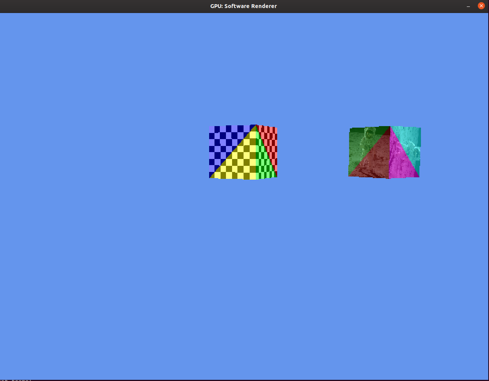
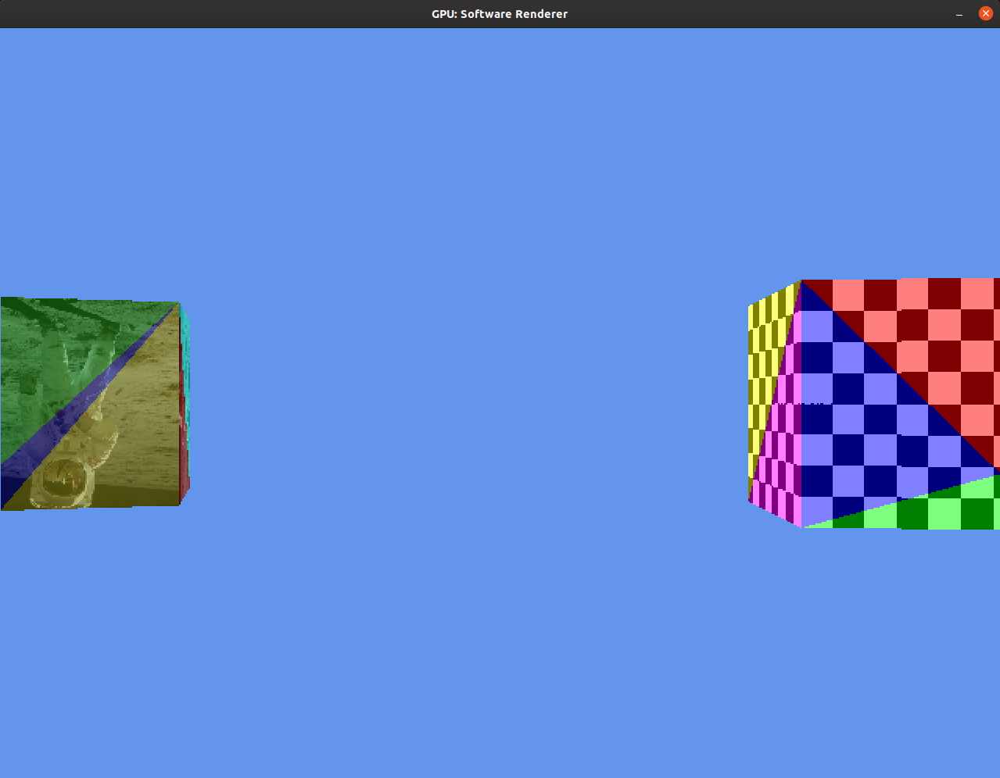

# 3D Software Renderer

This is a 3D renderer which I originally intended to be an emulator for an
implementation of a fixed-function 3D rendering pipeline on an FPGA.

The colored tint on the triangles shows where the emulator is clipping triangles
to the view frustum. Each face of the cubes enter the renderer as a pair of triangles,
but these are clipped as necessary to prevent any vertices from appearing outside
the viewport. Any triangles completely outside the viewport are culled.

